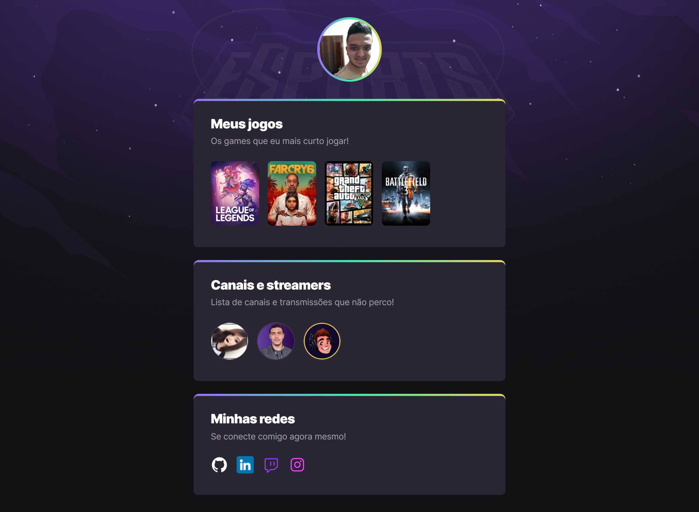
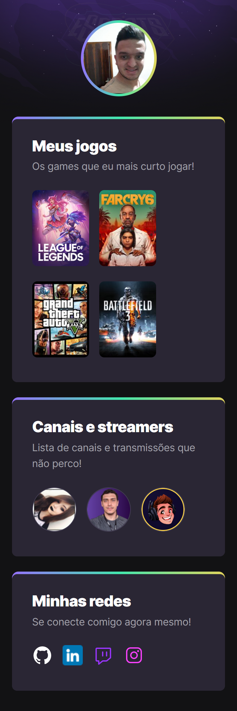

<h1 align="center">
  NLW eSports - Trilha Explorer
</h1>

  

  <a href="#-tecnologias">Tecnologias</a>&nbsp;&nbsp;&nbsp;|&nbsp;&nbsp;&nbsp;
  <a href="#-projeto">Projeto</a>&nbsp;&nbsp;&nbsp;|&nbsp;&nbsp;&nbsp;
  <a href="#-inspiração">Inspiração</a>&nbsp;&nbsp;&nbsp;|&nbsp;&nbsp;&nbsp;

 

  

## 🚀 Tecnologias

Esse projeto foi desenvolvido com as seguintes tecnologias:

- HTML
- CSS

## 🚧 Projeto:

[🔗 Clique aqui para acessar](https://nlw-esports-theta.vercel.app/)

## 🎨 Inspiração:

[🔗 FIGMA](<https://www.figma.com/file/IhyEeBBb92cUEm8lCCNSuf/NLW-eSports-(Community)>)

## :memo: Licença

Esse projeto está sob a licença MIT. Veja o arquivo [LICENSE](LICENSE) para mais detalhes.

---

Feito com ♥ by GabriellRossi
